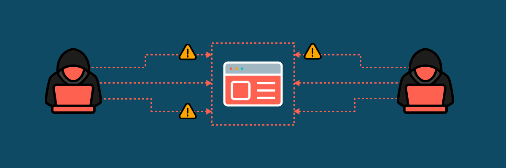

[Write-up](https://outpost24.com/blog/cross-site-scripting-attacks-how-protect-against/)

In [this](https://outpost24.com/blog/cross-site-scripting-attacks-how-protect-against/) blog post, my colleagues at Outpost24 and I walkthrough some of the wilder Cross-Site Scripting attacks we've managed to conceive recently, and highlight the importance of considering context when crafting an impactful exploit.