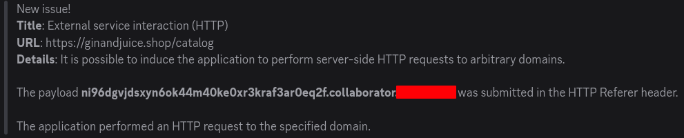
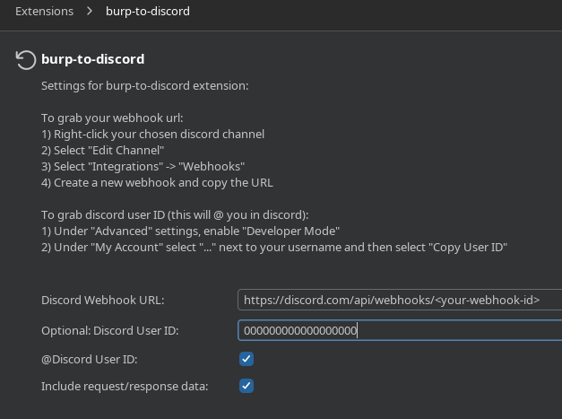

When performing security research in your spare time, long running scans that may or may not result in your next research topic or bounty are difficult to ignore. To help prevent my habit of constantly checking my research machine for new issues, I've built a burp extension that reports any issues directly to a discord webhook. That way, if my scan is actually producing results, I know right away and I don't have to wait until I get home, only to be disappointed by a lack of results. 

To setup the extension, you can use the new settings panel, which you'll find in burp's regular settings. 

When everything is setup, any and all issues that appear in burp will be reported to the webhook. 

[Extension](https://portswigger.net/bappstore/fb94931733ef46d89ee260df8f102f2f)

[Code](https://github.com/portswigger/burp-to-discord)

